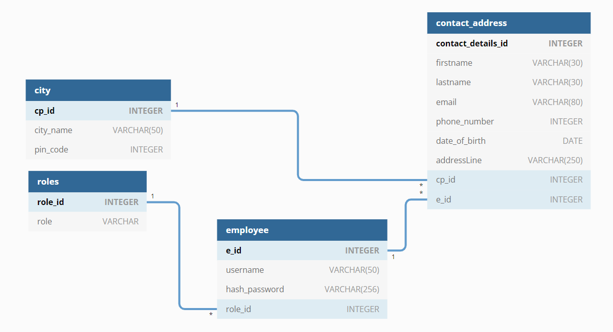

# Organization Employee Management Portal
---
## Introduction
Organization Employee Management Portal a flask based web application where organization employee can register, Sign in, search other employees.
And admins can manage permissions for every employees.

## Requirements
1. Baseic requirements `python3`, `sqlalchemy`, `Docker`, `Postman`, `VScode`
2. After Creating and activating Virtual env
3. Run `$ pip install -r requirements.txt` to install all reuirements
4. [Postman api calls collection path](./assets/advanced-python-web-dev-api-collection-postman.postman_collection.json)

## Assumptions:
> Sqlite Database
  * Sqlalchemy used for database
  * Database migration
  * `City` table - pin codes are unique
  * Admin `username` : subhajit `password`: 123456789

> Register Employee
  * Employee can register with `username` and `password`
  * `Username` should be unique and non numeric
  * After successful registration employee autometically logged in and redirected to profile page to fill contact details
  * `Email` and `Phone Numbers` are uinque and can not be updated by admin or employee
  * While registration if employee enters a new pin code then this new data is saved in `City` table with city name and a foeign key reference will set
  * Otherwise `City` table's `City.cp_id` will be a foreign key 
  * `Passwords` are encoded with `bcrypt` while saving in the DB

> Login Employee
  * Login by username and password
  * After login redirect to home page
  * login session time out is 1800 sec or 30 min

> Employee Permissions
  * Roles
    1. admin ( role_id = 1 )
    2. employee ( role_id = 2 )
  * When an employee registered default role is - `employee`
  * First admin made manually
  * Admin can change any active or inactive employee's permission except himself
  * Admin can remove any employee except himself

> Master Page
  * List all Employees
  * Show extra actions for admin users
  * Search bar to search employees

> Search Employee
  * Search by city name or username

## Build and Run Application
> Local development server
  * Open project folder
  * Run `$ python setup.py`

> Docker configuration
  1. Open project folder
  2. Run `$ docker-compose build` to build image and `$ docker-compose up -d` to start container in detatched mode
  3. To view on browser `http://localhost:8000/`

> Testing
  * Package name: `pytest` 
  * To run test cases go to Project root folder `advanced-python-web-dev`
  * Open terminal and activate `venv`
  * Then Run `$ python -m pytest -p no:warning tests/` 
  * This will run all test cases. `conftest` file is test case configuration file 

---
## Sqlite Database Schema

